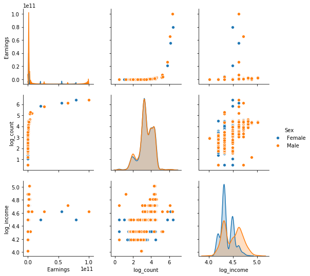

# 2011 Census Data: 
# NSW Electorates, Income, Education and Gender

In this mini-project, I explore a subset of the 2011 Australian Census selecting NSW Regional Electorates, the High School Education level of the population, their income and their gender. From this I attempt to look for relationships between Education and Income, Gender and Income and Gender and Education.

## Insights and known problems:

This dataset, although fairly basic, revealed quite a few interesting features of how Education and Gender play a role in the maximum income levels seen in the 2011 NSW population.

### Insights

* Maximum Yearly Income is strongly positively correlated with Education. At worst, it is linearly related to Education and at best exponentially related to Education level. The higher your education level, the higher your likely maximum yearly income will be. This is independent of Gender, although Males outperform Females in terms of income across very Education class.

    * Curiously, there is an inversion where people who left school at Year 10, on average, **earn more** than those people who left in Year 11. This probably reflects the case that Year 10 leavers are focused on employment, perhaps in a Trade, while Year 11 leavers have ignored the Trade path, but not succeeded at making it to Year 12 and thus do not find employment commensurate with their Education level. Year 11 is somewhat of a limbo year in terms of accepted qualifications.

* Across NSW, more people complete Year 12 than any other level of schooling, but Year 10 leavers outnumber Year 11 leavers and these distributions are fairly narrow. This suggests that the reasons for terminating ones Education at either Year 10 or Year 11, are common across the State.

    * For lower Education levels: "Did not go to School", "Year 8 or equivalent" and "Year 9 or equivalent", these distributions are much broader suggesting regional factors may be at play in determining why people are not going on to higher levels of study. Also consider that the dataset does not contain the **age** of the population and so some of the Education levels will be baked in by the older population.

* Females dominate the lower salary jobs in terms of number **but** in **every** Education level they earn less money than their Male counterparts with the same qualifications.

* The general population is almost exclusively split 50/50, although there are a few places where Males outnumber Females.

* The median income (maximum yearly salary) for Females is $31,199.

* The median income (maximum yearly salary) for Males is $41,599.

* The Electorate which generates the most total salary in NSW 2011 is Sydney.

* The Electorate which generates the least total salary in NSW 2011 is Cabramatta.

* The Electorate with the highest disparity between Male and Female incomes is the North Shore.

* The Electorate with the lowest disparity between Male and Female incomes is Ballina.

### Problems

* The biggest issue with the data is that even in the raw tables, the total number of people in NSW is over 9.8 million people. This is clearly excessive even by today's population estimates. Unfortunately, I was not able to determine why this might be the case, hopefully the excess number of people are not skewing any of the results but rather just raising everything equally.

* The income estimates are low. The median income levels per gender/education/electorate are below the official estimates by about $20,000. 

* Code optimization: as with any code there will almost always be ways to improve and enhance the code. In general, I've tried to ensure that any method is not highly inefficient and to improve code where warnings arise. Some of these issue still remain however they do not impede us from drawing conclusions from the data and so given the nature of this project I have decided to live with the imperfections.

While in an operational dataset, I would dig deeper to resolve these discrepancies, for this mini-project I just recognise that they exist and infer what we can given the results we find.

## The Data and The Code

The data was collected from the Australian Bureau of Statistics and code to generate the figures uses was written in Python.


```python
#census data exploration
import pandas as pd
import numpy as np
import re
import seaborn as sns
import matplotlib.pyplot as plt
from scipy.optimize import curve_fit
import copy

df = pd.read_csv("2011CensusData_NSW_Electorates_Education_Income_Gender.csv")

print(df.head(20))

population = df.Count[df.Sex == 'Female'][df.Electorate == 'Total'].sum()+ df.Count[df.Sex == 'Male'][df.Electorate == 'Total'].sum()
print("2011 NSW Population: ",population)


```

       Electorate            HighSchool                               TPI     Sex  \
    0      Albury  Did not go to school              $1-$199 ($1-$10,399)    Male   
    1      Albury  Did not go to school              $1-$199 ($1-$10,399)  Female   
    2      Albury  Did not go to school                        Nil income    Male   
    3      Albury  Did not go to school                        Nil income  Female   
    4      Albury  Did not go to school       $200-$299 ($10,400-$15,599)    Male   
    5      Albury  Did not go to school       $200-$299 ($10,400-$15,599)  Female   
    6      Albury  Did not go to school       $300-$399 ($15,600-$20,799)    Male   
    7      Albury  Did not go to school       $300-$399 ($15,600-$20,799)  Female   
    8      Albury  Did not go to school       $400-$599 ($20,800-$31,199)    Male   
    9      Albury  Did not go to school       $400-$599 ($20,800-$31,199)  Female   
    10     Albury  Did not go to school       $600-$799 ($31,200-$41,599)    Male   
    11     Albury  Did not go to school       $600-$799 ($31,200-$41,599)  Female   
    12     Albury  Did not go to school       $800-$999 ($41,600-$51,999)    Male   
    13     Albury  Did not go to school       $800-$999 ($41,600-$51,999)  Female   
    14     Albury  Did not go to school   $1,000-$1,249 ($52,000-$64,999)    Male   
    15     Albury  Did not go to school   $1,000-$1,249 ($52,000-$64,999)  Female   
    16     Albury  Did not go to school   $1,250-$1,499 ($65,000-$77,999)    Male   
    17     Albury  Did not go to school   $1,250-$1,499 ($65,000-$77,999)  Female   
    18     Albury  Did not go to school  $1,500-$1,999 ($78,000-$103,999)    Male   
    19     Albury  Did not go to school  $1,500-$1,999 ($78,000-$103,999)  Female   
    
        Count  Unnamed: 5  
    0       8         NaN  
    1       8         NaN  
    2       8         NaN  
    3      13         NaN  
    4      29         NaN  
    5      45         NaN  
    6      29         NaN  
    7      28         NaN  
    8      22         NaN  
    9      14         NaN  
    10     12         NaN  
    11      7         NaN  
    12      4         NaN  
    13      3         NaN  
    14      0         NaN  
    15      0         NaN  
    16      0         NaN  
    17      0         NaN  
    18      3         NaN  
    19      0         NaN  
    ('2011 NSW Population: ', 9889298)


As you can see above, the data table contains some interesting columns. The categories are built into the table itself, the Education and the Incomes are input as "Strings" and these properties are aggregated already in the Count column. For good measure, we have a column on NaNs. Note: the population is too high to reflect reality.

First step is to create a column which indexes the Education level to an integer for easy reference later on.


```python
#let's try and do a clean up

## firstly let's create some columns which represent the education level numerically
df['Education'] = ""
for i in range(len(df.HighSchool.unique())):
    Edu_key = df.HighSchool.unique()
    print(df.HighSchool.unique()[i])
    condition = (df['HighSchool'] == df.HighSchool.unique()[i])
    df['Education'].loc[condition] = i
```

    Did not go to school
    Year 8 or below
    Year 9 or equivalent
    Year 10 or equivalent
    Year 11 or equivalent
    Year 12 or equivalent
    Total


Now let's extract out the incomes and populate some new columns.

Here we are using **regular expressions** to find all the numbers in the string and put them into the columns as shown.


```python
## extract incomes from string column into new columns
df['WeeklyMin'] = ""
df['WeeklyMax'] = ""
df['YearlyMin'] = ""
df['YearlyMax'] = ""
for i in range(len(df.TPI.unique())):
    TPI_key = df.TPI.unique()
    str1 = df.TPI.unique()[i]
    print(i, str1)
    output = [float(s.replace(',','')) for s in re.findall(r'-?\d+,?\d*', str1)]
    print(output, len(output))
    
    condition = (df['TPI'] == df.TPI.unique()[i])
    
    if (len(output) == 4):
        df['WeeklyMin'].loc[condition] = output[0]
        df['WeeklyMax'].loc[condition] = output[1]
        df['YearlyMin'].loc[condition] = output[2]
        df['YearlyMax'].loc[condition] = output[3]

    elif (len(output) == 2):
        df['WeeklyMin'].loc[condition] = output[0]
        df['WeeklyMax'].loc[condition] = output[0]
        df['YearlyMin'].loc[condition] = output[1]
        df['YearlyMax'].loc[condition] = output[1]
    
    elif (len(output) == 0):
        df['WeeklyMin'].loc[condition] = 0.0
        df['WeeklyMax'].loc[condition] = 0.0
        df['YearlyMin'].loc[condition] = 0.0
        df['YearlyMax'].loc[condition] = 0.0


```

    (0, '$1-$199 ($1-$10,399)')
    ([1.0, 199.0, 1.0, 10399.0], 4)
    (1, 'Nil income')
    ([], 0)
    (2, '$200-$299 ($10,400-$15,599)')
    ([200.0, 299.0, 10400.0, 15599.0], 4)
    (3, '$300-$399 ($15,600-$20,799)')
    ([300.0, 399.0, 15600.0, 20799.0], 4)
    (4, '$400-$599 ($20,800-$31,199)')
    ([400.0, 599.0, 20800.0, 31199.0], 4)
    (5, '$600-$799 ($31,200-$41,599)')
    ([600.0, 799.0, 31200.0, 41599.0], 4)
    (6, '$800-$999 ($41,600-$51,999)')
    ([800.0, 999.0, 41600.0, 51999.0], 4)
    (7, '$1,000-$1,249 ($52,000-$64,999)')
    ([1000.0, 1249.0, 52000.0, 64999.0], 4)
    (8, '$1,250-$1,499 ($65,000-$77,999)')
    ([1250.0, 1499.0, 65000.0, 77999.0], 4)
    (9, '$1,500-$1,999 ($78,000-$103,999)')
    ([1500.0, 1999.0, 78000.0, 103999.0], 4)
    (10, '$2,000 or more ($104,000 or more)')
    ([2000.0, 104000.0], 2)


Let's have a quick look at the data and see what we can find.


```python
#let's make some figures to try to see what we have in the data.
#location = 'Bankstown'
location = 'Albury'
condition = ((df['Electorate'] == location)& (df['HighSchool'] != 'Total'))
title = 'Electorate: ' + location
newx = df['YearlyMax'][condition]
newy = df['Count'][condition]
newhue = df['HighSchool'][condition]
# 
plt.figure()
g = sns.scatterplot(newx, newy, hue=newhue,palette='Set2', style=df.Sex[condition], legend='full')
plt.title(title)
plt.show()
```


The figure above shows the Yearly Max salary for the different education levels sorted by Gender but while careful inspection can reveal much about the data, let's try and make something a bit clearer.

In the next section, I explore determining the median income per education level per gender per electorate with a test case.

The tricky thing here is that finding the median is not straightforward as the data is already aggregated. Although if we could the number of people, find the ranking for the middle person then order the incomes ascending and start counting from the lowest incomes we can figure out which income the median person has.


```python
##let's calculate the median income per education level per sex per electorate

##let's create a test case

location = 'Rockdale'
education = 'Year 12 or equivalent'
gender = 'Male'

condition = ((df['Electorate'] == location) & 
             (df['HighSchool'] == education) &
             (df['Sex'] == gender))
             
#how many people meet this condition?
npeople = df.Count[condition].sum()
print(df.Count[condition].sum())

#the median income will be the (npeople/2)th person.
print(int(npeople/2.))
median_income_person = int(npeople/2.)

#let's find this person.

#make a new array from the counts
newtable = np.array(df.Count[condition])

def find_median_person(table, median_income_person):
    median_finder = 0
    for i in range(len(table)):
        
        median_finder += table[i]
        if median_finder < median_income_person:
            continue
        else:
            break
    return(median_finder, i)        

median_finder, i = find_median_person(newtable, median_income_person)

print(median_finder, i)

##which max income bracket does this correspond to?

median_income_bracket = df.TPI.unique()[6]
print(median_income_bracket)
median_yearlymax_income = df['YearlyMax'][df.TPI == median_income_bracket].unique()[0]

```

    16812
    8406
    (9827, 6)
    $800-$999 ($41,600-$51,999)


Let's try and generate a table now which has these results built into it.

From this we can find the Male and Female median incomes for NSW.

** here we are using pivot tables and argsort to manipulate the data**


```python
#now we want to make a table which generates these results for locations, education levels and gender
pivot1 = df.pivot_table(values=["Count"], index=["Electorate","HighSchool","Sex"], aggfunc=np.sum).reset_index()
pivot1['midpoint']=(pivot1.Count/2).astype(int)  
     
#ordered incomes 
df.YearlyMax.sort_values(0).unique()

##let's generate the median incomes per row of the pivot table.

##---> Remember that the incomes in the original TPI column are not sorted numerically.
##---> So let's do that and keep track of where the elements should be.

YearlyMaxUnique = df.YearlyMax.unique()
IncomesSorted = YearlyMaxUnique.argsort(0)

TPIunique = df.TPI.unique()
TPIsorted = TPIunique[IncomesSorted[:]]
##let's generate the median incomes per row of the pivot table.

##---> Remember that the incomes in the original TPI column are not sorted numerically.
##---> So let's do that and keep track of where the elements should be.

YearlyMaxUnique = df.YearlyMax.unique()
IncomesSorted = YearlyMaxUnique.argsort(0)

TPIunique = df.TPI.unique()
TPIsorted = TPIunique[IncomesSorted[:]]

pivot1['MedianIncomes'] = ""

for i in range(len(pivot1)):
    
    condition = condition = (
             (df['Electorate'] == pivot1['Electorate'][i]) & \
             (df['HighSchool'] == pivot1['HighSchool'][i]) &\
             (df['Sex'] == pivot1['Sex'][i]))
             
    midpoint = pivot1['midpoint'][i]
    
    newtable = np.array(df.Count[condition])
    #sort newtable correctly using the IncomesSorted
    newtable = newtable[IncomesSorted[:]]
    
    median_finder, j = find_median_person(newtable,midpoint)
    median_income_bracket = TPIsorted[j]
    
    median_yearlymax_income = df['YearlyMax'][df.TPI == median_income_bracket].unique()[0]

    
    pivot1['MedianIncomes'][i] = median_yearlymax_income

print(pivot1.head(20))
#let's see if we can find the overall median income for NSW
condition = (pivot1.HighSchool != 'Total') &\
        (pivot1.Sex == 'Female')
trimmedIncomes = np.array(pivot1.MedianIncomes[condition])
MedianIncomesSorted = trimmedIncomes.argsort(0) 
trimmedCounts = np.array(pivot1.Count[condition])
CountSorted = trimmedCounts[MedianIncomesSorted[:]]

midpoint2 = (CountSorted.sum()/2).astype(int)

median_finder, k = find_median_person(CountSorted, midpoint2)
median_income_bracket = MedianIncomesSorted[k]

total_median_yearlymax_income_female = pivot1['MedianIncomes'][MedianIncomesSorted[k]]

print('Female median income: ',total_median_yearlymax_income_female)

condition = (pivot1.HighSchool != 'Total') & (pivot1.Sex == 'Male')
trimmedIncomes = np.array(pivot1.MedianIncomes[condition])
MedianIncomesSorted = trimmedIncomes.argsort(0) 
trimmedCounts = np.array(pivot1.Count[condition])
CountSorted = trimmedCounts[MedianIncomesSorted[:]]

midpoint2 = (CountSorted.sum()/2).astype(int)

median_finder, k = find_median_person(CountSorted, midpoint2)
median_income_bracket = MedianIncomesSorted[k]

total_median_yearlymax_income_male = pivot1['MedianIncomes'][MedianIncomesSorted[k]]

print('Male median income: ',total_median_yearlymax_income_male)
```

    /Users/bconn/Library/Enthought/Canopy/edm/envs/myPython/lib/python2.7/site-packages/ipykernel_launcher.py:50: SettingWithCopyWarning: 
    A value is trying to be set on a copy of a slice from a DataFrame
    
    See the caveats in the documentation: http://pandas.pydata.org/pandas-docs/stable/indexing.html#indexing-view-versus-copy


       Electorate             HighSchool     Sex  Count  midpoint MedianIncomes
    0      Albury   Did not go to school  Female    118        59         15599
    1      Albury   Did not go to school    Male    115        57         20799
    2      Albury                  Total  Female  26311     13155         31199
    3      Albury                  Total    Male  24786     12393         41599
    4      Albury  Year 10 or equivalent  Female   7564      3782         31199
    5      Albury  Year 10 or equivalent    Male   8017      4008         41599
    6      Albury  Year 11 or equivalent  Female   3229      1614         31199
    7      Albury  Year 11 or equivalent    Male   3101      1550         41599
    8      Albury  Year 12 or equivalent  Female  11062      5531         31199
    9      Albury  Year 12 or equivalent    Male   8889      4444         51999
    10     Albury        Year 8 or below  Female   1813       906         20799
    11     Albury        Year 8 or below    Male   1913       956         20799
    12     Albury   Year 9 or equivalent  Female   2517      1258         20799
    13     Albury   Year 9 or equivalent    Male   2755      1377         31199
    14     Auburn   Did not go to school  Female   1554       777         15599
    15     Auburn   Did not go to school    Male   1120       560         15599
    16     Auburn                  Total  Female  31034     15517         20799
    17     Auburn                  Total    Male  31357     15678         31199
    18     Auburn  Year 10 or equivalent  Female   4673      2336         20799
    19     Auburn  Year 10 or equivalent    Male   4783      2391         31199
    ('Female median income: ', 31199)
    ('Male median income: ', 41599)


Pivot1 Table shows how regardless of Education Level Males outperform Females in terms of income.

As we can see these numbers for median income are a bit low compared to the known values, but let's carry on and see what we find out if we break this down by Electorate and look for the Electorates with the largest and smallest disparities in income. **more pivot tables**


```python
pivot1["Earnings"] = pivot1.Count * pivot1.MedianIncomes
pivot1a = pivot1.pivot_table(values=["Count"], index=["Electorate"],columns=["Sex"], aggfunc=sum).reset_index()
pivot1b = pivot1.pivot_table(values=["Earnings"], index=["Electorate"],columns=["Sex"], aggfunc=sum).reset_index()
##let's do a merge on these tables
pivot1ab = pd.merge(pivot1a, pivot1b, 'left', on = ["Electorate"])
pivot1ab["average difference"] = pivot1ab.Earnings.Male/pivot1ab.Count.Male - pivot1ab.Earnings.Female/pivot1ab.Count.Female

median_diff = pivot1ab["average difference"].median() #median difference between Male and Female incomes
Electorate_maxDiff = pivot1ab.Electorate[pivot1ab["average difference"] == pivot1ab["average difference"].max()]
Income_maxDiff = pivot1ab["average difference"].max()

print("Least Equal Electorate: ", Electorate_maxDiff.values[0], int(Income_maxDiff))

Electorate_minDiff = pivot1ab.Electorate[pivot1ab["average difference"] == pivot1ab["average difference"].min()]
Income_minDiff = pivot1ab["average difference"].min()

print("Most Equal Electorate: ",Electorate_minDiff.values[0], int(Income_minDiff))
```

    ('Least Equal Electorate: ', 'North Shore', 43772)
    ('Most Equal Electorate: ', 'Ballina', 2345)


Let's see if we can find the richest and poorest Electorates based on the total salary of their constituents.

We first generate a table with "Electorate  YearlyMax HighSchool Count" then generate the "Earnings" column by multiplying YearlyMax and Count.

In the next table, we have Electorate and Earnings, where we have summed the "Earnings" from Pivot2 per region.


```python
##Let's find the richest and poorest Electorates

pivot2 = df.pivot_table(values=["Count"], index=["Electorate","YearlyMax","HighSchool"], aggfunc=np.sum).reset_index()
pivot2['Earnings'] = pivot2.YearlyMax*pivot2.Count

print("Pivot 2 table")
print(pivot2.head(20))

pivot3 = pivot2.pivot_table(values=["Earnings"], index=["Electorate"], aggfunc=np.sum).reset_index()

print("Pivot 3 table")
print(pivot3.head(20))
condition = (pivot3.Electorate != 'Total') & (pivot3.Electorate != 'Migratory - Offshore - Shipping (NSW)') & (pivot3.Electorate != 'No Usual Address (NSW)')
print(pivot3.Electorate[pivot3.Earnings == pivot3.Earnings[condition].max()], np.max(pivot3.Earnings[condition]))

print(pivot3.Electorate[pivot3.Earnings == pivot3.Earnings[condition].min()], np.min(pivot3.Earnings[condition]))

```

    Pivot 2 table
       Electorate  YearlyMax             HighSchool  Count  Earnings
    0      Albury          0   Did not go to school     21         0
    1      Albury          0                  Total   3267         0
    2      Albury          0  Year 10 or equivalent    992         0
    3      Albury          0  Year 11 or equivalent    438         0
    4      Albury          0  Year 12 or equivalent    884         0
    5      Albury          0        Year 8 or below    286         0
    6      Albury          0   Year 9 or equivalent    657         0
    7      Albury      10399   Did not go to school     16    166384
    8      Albury      10399                  Total   4036  41970364
    9      Albury      10399  Year 10 or equivalent   1230  12790770
    10     Albury      10399  Year 11 or equivalent    719   7476881
    11     Albury      10399  Year 12 or equivalent   1328  13809872
    12     Albury      10399        Year 8 or below    251   2610149
    13     Albury      10399   Year 9 or equivalent    487   5064313
    14     Albury      15599   Did not go to school     74   1154326
    15     Albury      15599                  Total   6215  96947785
    16     Albury      15599  Year 10 or equivalent   1868  29138932
    17     Albury      15599  Year 11 or equivalent    600   9359400
    18     Albury      15599  Year 12 or equivalent   1756  27391844
    19     Albury      15599        Year 8 or below    920  14351080
    Pivot 3 table
            Electorate    Earnings
    0           Albury  4048022016
    1           Auburn  4356746339
    2          Ballina  3675841458
    3          Balmain  6834036432
    4        Bankstown  3504404996
    5           Barwon  3371333208
    6         Bathurst  4122400164
    7   Baulkham Hills  5200791030
    8             Bega  3418233341
    9        Blacktown  4285349135
    10  Blue Mountains  4365096299
    11      Burrinjuck  3650540071
    12      Cabramatta  3121750737
    13          Camden  4910846203
    14    Campbelltown  3787896626
    15      Canterbury  4761453840
    16     Castle Hill  5457962529
    17        Cessnock  4069037225
    18     Charlestown  4074844926
    19        Clarence  3343032579
    (80    Sydney
    Name: Electorate, dtype: object, 9406671769)
    (12    Cabramatta
    Name: Electorate, dtype: object, 3121750737)


Let's now explore the relationship between Education and Income and look for a trend. In this case, we'll use the **lmplot** function to fit a line and also **curve_fit** to fit an exponential.


```python
pivot4 = pivot2.pivot_table(values=["Earnings", "Count"], index=["HighSchool"], aggfunc=np.sum).reset_index()
pivot4["average income"] = pivot4.Earnings / pivot4.Count

pivot4["Education Key"] = ""
for i in range(len(df.HighSchool.unique())):
    condition = (pivot4['HighSchool'] == df.HighSchool.unique()[i])
    pivot4["Education Key"] .loc[condition] = i

pivot4 = pivot4.drop([1]) #dump the Total row to make it easier to plot.

model = lambda x, A, x0, c, offset:  offset+A*np.exp(c*(x-x0))
popt, pcov = curve_fit(model, pivot4["Education Key"].values,
                              pivot4["average income"].values, p0=[1,0,2,0])

#build model to plot
x_model = np.linspace(pivot4["Education Key"].values.min(),pivot4["Education Key"].values.max(),250)

labels = np.array(pivot4.sort_values("Education Key").HighSchool.values)

#plt.figure()
sns.lmplot(x="Education Key", y="average income", data=pivot4, order=1, legend=False)
plt.plot(x_model,model(x_model,*popt),'r-', label="Exponential Fit")
plt.xticks(np.arange(6),labels, rotation=15)
plt.show()

```


Both fits look reasonable, except that the Year 10 and Year 11 data are not following the expected trend. Let's implement some **pairplots** to investigate this.

We're going to have to take the log of some values here which will get an error for an value of zero. But since we expect that we'll soldier on.


```python
pivot11 = copy.deepcopy(pivot1) #keep a copy
pivot1['log_count'] = np.log10(pivot1['Count'])
pivot1['log_income'] = np.log10(pivot1['MedianIncomes'].astype(float))
pivot1 = pivot1.drop(columns = ['Count', 'MedianIncomes', 'midpoint'])
#plt.figure()
sns.pairplot(pivot1, hue="Sex")
plt.show()
```

    /Users/bconn/Library/Enthought/Canopy/edm/envs/myPython/lib/python2.7/site-packages/ipykernel_launcher.py:2: RuntimeWarning: divide by zero encountered in log10
      
    /Users/bconn/Library/Enthought/Canopy/edm/envs/myPython/lib/python2.7/site-packages/ipykernel_launcher.py:3: RuntimeWarning: divide by zero encountered in log10
      This is separate from the ipykernel package so we can avoid doing imports until





There is a lot information in the above plot but let's focus on the two lower panels on the diagonal.

The middle panel is a distribution of the number of people in each Electorate by Gender. What we see is the in general the population is split 50/50 on Gender but for smaller communities it seems there are an excess of Males.

The lower right panel shows the Male/Female income distribution. Females dominate the lower income brackets clearly outnumbering Males. Males however exclusively dominate the high income brackets.

Let's now look at Earnings against Education.


```python
pivot22 = copy.deepcopy(pivot2) #keep a copy
pivot2['log_count'] = np.log10(pivot2['Count'])
pivot2['log_Earnings'] = np.log10(pivot2['Earnings'])
pivot2 = pivot2.drop(columns = ['Count', 'Earnings'])

condition = (pivot2.HighSchool != "Total")
#plt.figure()
sns.pairplot(pivot2[condition], hue="HighSchool")
plt.show()

```

    /Users/bconn/Library/Enthought/Canopy/edm/envs/myPython/lib/python2.7/site-packages/ipykernel_launcher.py:2: RuntimeWarning: divide by zero encountered in log10
      
    /Users/bconn/Library/Enthought/Canopy/edm/envs/myPython/lib/python2.7/site-packages/ipykernel_launcher.py:3: RuntimeWarning: divide by zero encountered in log10
      This is separate from the ipykernel package so we can avoid doing imports until


In the final figure, let's focus again on the diagonals to begin with.

**Top left:** shows the distribution of incomes across the State and interestingly there is a significant subset of the population that earns significantly more than the rest of the population.

**Middle/Middle:** shows the populace of NSW distributed by Education level. Most Electorates have more people who completed Year 12 than didn't, followed by Year 10, Year 11 and so on. All the distributions are overlapping with Year 9 and 11 occupying almost the same space. The narrowness of the Year 10, 11 and 12 suggests that across NSW the people choosing to stop their education at those stages are doing so for very similar reasons. The bottom three education levels have a much broader distribution which means that the levels of participation varies significantly from Electorate to Electorate, so perhaps the reasons for this variation is due to location and regional issues.

**Lower right:** shows the distribution of incomes across NSW. As we saw in the second figure, Year 12 graduates typically earn more than any other Education class, although close inspection reveals that each level will have some people in all economic ranges although the bulk follow statewide trends. Again, Year 10 graduates typically earn more than Year 11 graduates who are essentially on the same economic footing as Year 9 graduates despite 2 extra years of education. We can see though that Year 11 graduates outnumber Year 9 graduates. Year 8 and "Did not go to school" members of the population have consistently the lowest incomes across the board and are not an insubstantial part of the community if we consider the area under those curves.
