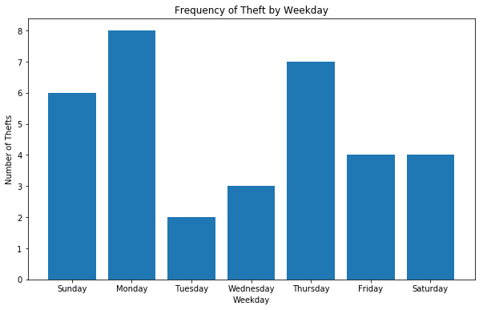
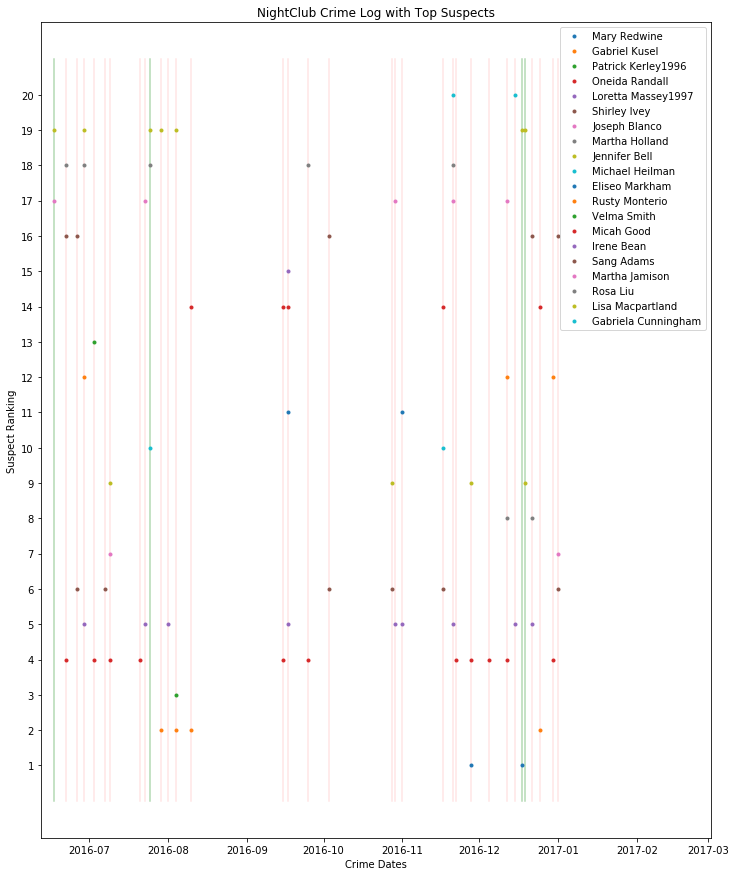

# Freelancer NightClub: Thieving Thieves and Dubious Dancers 

This report will outline the results of our short analysis on the data provided, listing the various assumptions, the list of suspicious persons and potential follow-up analysis that would provide more insight into the likelihood of any given person being a suspect. This will be followed by a more technical description of the work including the Python code which used a Bayesian Probaility to derive a list of potential suspects (at the end). 


## Summary and Overview of Analysis

Over the period of 16th June 2016 to 1st January 2017, Freelancer NightClub experienced 34 nights where patrons reported items being stolen. Around 985 people patronized the Club during this period accumulating a total of 42,727 visits.

Our first step in analyzing the data is to determine who was in the Club during the robberies and how many times was a given Patron present during a robbery. 

From this we determine:
   - Many Patrons were present during almost of all the crimes
   - These people are not suspects but rather diehard supporters of the Club
   - A Bayesian Probability Index helps provide a ranked list of suspects
    
## Bayesian Probability

While many people were in the Club for most, if not all the crimes, we need to take into account how many times they visited the Club before we assign suspicion to any given Patron. For those Patrons who were present during a Crime Night, the average number of return visits to the Club by that Patron was 46 times and for one diehard fan, they visited the Club 169 times. It is clear therefore that we need to account for the time a Patron was at the Club on a Non-Crime Night to help us assess whether they might be suspicious or not.

Therefore we implement the following Bayesian probability estimate for each Patron to calculate *the probability of a crime being committed while that Patron is present*:

    P(Crime|Visit) = P(Visit|Crime)*P(Crime) / ( P(Visit|Crime)*P(Crime) + P(Visit|No Crime)*P(No Crime) )
    
    where  - P(Visit|Crime) is the probability of a patron visiting during a crime
           - P(Crime) is the probability of a crime occuring
           - P(Visit|No Crime) is the probability of a patron visiting and no crime is committed
           - P(No Crime) is the probability of no crime occuring
   
In this way, we use both the visits during the time of a crime and the visits during times of no crime to assign the Probability. 

*The higher the probability the more likely they are the thief.*

## Assumptions

The assumptions built into our results are as follows:
   - The thief is a Patron of the Club and **not** a member of Staff
   - All of the "Crime Nights" are instances where are real robbery occured and cannot be considered as a False Positive in any way.
   - The robberies are **not** random.
   - One Thief per night per crime

## Results

   - We find that there is no single Patron responsible for all of the crimes.
   - We find that there is no evidence that multiple Patrons are working together to commit the robberies
   - Although the Top 6 suspicious Patrons account for all of the crimes, we have some reservations regarding two of them
     - Patrick Kerley (1996) patronized the Club only Once and it happened to be a Crime Night. This may just be random chance.
     - Mary Redwine patronized the Club twice, the first time the day after her birthday and then a second time a few weeks later. This may, again, be random chance and needs further investigation.
   - The most suspicious Patrons are:
        1. Oneida Randall [11 Crime Nights]
        2. Gabriel Kusel [4 Crime Nights]
        3. Loretta Massey (1997) [9 Crime Nights]
        4. Shirley Ivey [6 Crime Nights]
        5. The remaining 4 Crimes Nights:
            - Lisa Macpartland was there for all of them
            - Mary Redwine, Jennifer Bell, Michael Heilman, Rosa Lieu and Martha Jamison all have one unexplained night
        6. Secondary Tier investigations should focus on: Joseph Blanco, Martha Holland, Velma Smith, Micah Good, Rusty Monterio, Eliseo Markham, Irene Bean, Sang Adams and Joshua Archibald
            
Caveats: We cannot exclude the possibility of multiple individual thieves commiting most of the crimes and the names listed here merely point to our *best guess* likelihood that a given Patron is worth investigating.

## Future Work

The current code is constructed such that with every new data point we obtain a better estimate for whether a given patron is suspicious or not. This provides the Club with an machine learning model for assessing their patrons.

However, there is a distinct possiblity that the crimes are being randomly committed by someone who is **not** a Patron. In this scenario, the Patrons viewed suspiciously are simply extremely unlucky and subject to random events. Fortunately, given more time to analyse the data, we can test this hypothesis. Using a Monte-Carlo simulation, we can randomize the Nights of the Crimes and calculate for each Patron their attendance for both the new Crime and No-Crime Nights. Repeating this randomization, over and over, we can build up a picture of the likelihood of a Patron exhibiting the Crime-to-No-Crime ratio as we see in the raw data. Outliers from the expected distribution will become the most suspect Patrons.

## Technical Details

From here, I will show the code which produced these results as well as some figures I used to support my analysis.


```python
import numpy as np
import pandas as pd
import seaborn as sns
import matplotlib.pyplot as plt
from datetime import timedelta

## read in the files and convert dates into DateTime format for ease of use later.

club_log = pd.read_csv("visitor_log.csv")
theft_log = pd.read_csv("theft_log.csv", header=None)

club_log.head()
club_log.shape

theft_log.head()
theft_log.shape

theft_log.columns = ['date']

theft_log['date'] = pd.to_datetime(theft_log['date'])

club_log['visit_date']  = pd.to_datetime(club_log['visit_date'])
club_log['dob']  = pd.to_datetime(club_log['dob'])

##Number of total visits
print('Number of total visits:')
print(len(club_log))

## approximate number of unique visitors
print('Approximate number of unique visitors: ')
print(len(club_log['name'].unique()))

```

    Number of total visits:
    42727
    Approximate number of unique visitors: 
    985


### Data Quality Checks:

With so many Patrons it is possible that two or more Patrons will have the same name.
In this next section of code, I check for duplicate names and their Date Of Birth, then update the names of any duplicates using their Birthdays. This ensures that every Patron is uniquely identified. 

I also identified that no crimes were committed without a Patron being present.


```python
##check if names + dob are unique

## we are sorting on name and date of birth and getting a count of all visits by that patron and renaming the count column as we go.
## then we are grouping just by name and counting any duplicates.

df1 = club_log.groupby(['name','dob']).size().reset_index().rename(columns={0:'count'}).groupby('name').count().sort_values('count').reset_index()

print(df1.head())

##sift out any Patrons with the same name
doppelganger = df1[df1['count'] > 1]['name'].tolist()

## here we are going to change the names of the doppelgangers to have their year as part of their name.
## that way we can tell them apart.

def newN(x):
    if (x[0] in doppelganger):
        year=str(x[1]).split('-')
        y=str(x[0])+year[0]
    else:
        y=str(x[0])
    return y

## Generate a new column with the new names.
club_log['new']=club_log[['name','dob']].apply(newN, axis=1)

## here is what the two "Willie Gould's" end up looking like.
print(club_log[['name','new']][club_log['name']=='Willie Gould']).head(10)

```

                 name  dob  count
    0    Aaron Nelson    1      1
    1  Mary Jefferson    1      1
    2      Mary Laura    1      1
    3     Mary Lofton    1      1
    4     Mary Murray    1      1
                  name               new
    61    Willie Gould  Willie Gould1995
    156   Willie Gould  Willie Gould1996
    701   Willie Gould  Willie Gould1995
    795   Willie Gould  Willie Gould1996
    916   Willie Gould  Willie Gould1995
    997   Willie Gould  Willie Gould1996
    1136  Willie Gould  Willie Gould1995
    1533  Willie Gould  Willie Gould1995
    1624  Willie Gould  Willie Gould1996
    1848  Willie Gould  Willie Gould1996


### Quick Check for any patterns in the Crimes
I had a look at the distribution of Crimes across the days of the week. Any patterns here would determine whether we need to look at frequency of crimes in our analysis.


```python
club_log['day_of_week'] = club_log['visit_date'].dt.day_name()
theft_log['day_of_week'] = theft_log['date'].dt.day_name()

by_day = theft_log.groupby(['day_of_week']).count()
sorter = ['Sunday', 'Monday', 'Tuesday', 'Wednesday', 'Thursday', 'Friday', 'Saturday']
sorterIndex = dict(zip(sorter,range(len(sorter))))
#sorterIndex
by_day['Day_id'] = by_day.index
by_day['Day_id'] = by_day['Day_id'].map(sorterIndex)
by_day.head()  
by_day.sort_values('Day_id', inplace=True)
by_day.reset_index()
by_day.head() 

fig, ax = plt.subplots(figsize=(10,6), facecolor='white')
 
ax.bar(by_day.Day_id, by_day.date)
ax.set_xticks([x for x in by_day.Day_id])
ax.set_xticklabels(by_day.index)
ax.set_facecolor('white')
ax.set_title('Frequency of Theft by Weekday')
ax.set_ylabel('Number of Thefts')
ax.set_xlabel('Weekday')
plt.show()

```





As we can see the Crime Rate is fairly flat suggesting that looking for periods in the crime or visits to the Club will not be necessary.

### Patrons Present during Crime Nights
To filter out those patrons who were present during a crime, we first need to organise the Patrons by date. Thereby determining who was in the Club on any given night.

With this list we can cross-match it with the Crime Night list and find out who was in the Club on those nights.


```python
df2 = club_log.groupby(['visit_date'])['new'].apply(list).reset_index()
#checking how many people visited on any given day
print(club_log.groupby(['visit_date']).size().head())

#number of visits per person
partygoers = club_log.groupby(['new', 'dob']).size()

#how many times did a patron visit the Club
partygoers = partygoers.to_frame().reset_index()
partygoers.columns = ['new', 'dob','party_times']

## find list of Patrons present on a Crime Night
df3 = df2.merge(theft_log, right_on='date',left_on='visit_date',how='inner')

## Count how many times a patron was present during a Crime Night
suspects = df3['new'].apply(pd.Series).stack().value_counts().reset_index()
suspects.columns = ['suspects', 'crime_scenes']

## list suspect patrons, the number of times they visited the club, the number of times they were present during a Crime Night
suspect_partygoers = partygoers.merge(suspects, left_on='new', right_on='suspects', how='inner')

print(suspect_partygoers.head())
```

    visit_date
    2016-06-16    227
    2016-06-17    205
    2016-06-18    204
    2016-06-19    225
    2016-06-20    215
    dtype: int64
                 new        dob  party_times       suspects  crime_scenes
    0   Aaron Nelson 1994-12-12           67   Aaron Nelson            11
    1     Ada Tejeda 1997-05-24          145     Ada Tejeda            22
    2     Adam Berry 1995-11-02           26     Adam Berry             5
    3  Adam Dorsette 1996-12-07           13  Adam Dorsette             4
    4   Adam Johnson 1996-04-11           73   Adam Johnson            13


### Quantizing Suspicion.

Given the assumptions outline above, we implement our Bayesian Probability Estimator and ranks the Patrons in order of suspicion. Essentially, if you mostly visited the Club during Crime Nights, you are considered more suspicious than patrons who also attended on Nights of No Crime. This does potentially work against patrons with few visits but a perfect Crime Night ratio. I outlined two such cases in the Summary above.

Now, let us implement the Bayes Probability, order the Patrons and then make a figure to see if any Patrons might be working together.


```python
## Calculate the components of the Bayes Prob separately, then combine
suspect_partygoers['Prob_Visit_given_Crime'] = (suspect_partygoers['crime_scenes']/suspect_partygoers['party_times'])
suspect_partygoers['Prob_Crime'] = (float(len(theft_log['date'].unique()))/len(club_log['visit_date'].unique()))
suspect_partygoers['Prob_Visit_no_Crime'] = (suspect_partygoers['party_times']-suspect_partygoers['crime_scenes'])/suspect_partygoers['party_times']
suspect_partygoers['Prob_no_Crime'] =  (float(len(club_log['visit_date'].unique())) - float(len(theft_log['date'].unique())))/float(len(club_log['visit_date'].unique()))

suspect_partygoers['Bayes'] = \
    suspect_partygoers['Prob_Visit_given_Crime']*suspect_partygoers['Prob_Crime'] /\
    ( suspect_partygoers['Prob_Visit_given_Crime']*suspect_partygoers['Prob_Crime'] + \
     (suspect_partygoers['Prob_Visit_no_Crime']*suspect_partygoers['Prob_no_Crime']) )

suspect_partygoers = suspect_partygoers.sort_values('Bayes', ascending=False).reset_index()

suspect_partygoers[['suspects', 'party_times', 'crime_scenes', 'Bayes']].head(20)

```


<div>
<style scoped>
    .dataframe tbody tr th:only-of-type {
        vertical-align: middle;
    }

    .dataframe tbody tr th {
        vertical-align: top;
    }

    .dataframe thead th {
        text-align: right;
    }
</style>
<table border="1" class="dataframe">
  <thead>
    <tr style="text-align: right;">
      <th></th>
      <th>suspects</th>
      <th>party_times</th>
      <th>crime_scenes</th>
      <th>Bayes</th>
    </tr>
  </thead>
  <tbody>
    <tr>
      <th>0</th>
      <td>Mary Redwine</td>
      <td>2</td>
      <td>2</td>
      <td>1.000000</td>
    </tr>
    <tr>
      <th>1</th>
      <td>Gabriel Kusel</td>
      <td>4</td>
      <td>4</td>
      <td>1.000000</td>
    </tr>
    <tr>
      <th>2</th>
      <td>Patrick Kerley1996</td>
      <td>1</td>
      <td>1</td>
      <td>1.000000</td>
    </tr>
    <tr>
      <th>3</th>
      <td>Oneida Randall</td>
      <td>11</td>
      <td>11</td>
      <td>1.000000</td>
    </tr>
    <tr>
      <th>4</th>
      <td>Loretta Massey1997</td>
      <td>10</td>
      <td>9</td>
      <td>0.648305</td>
    </tr>
    <tr>
      <th>5</th>
      <td>Shirley Ivey</td>
      <td>8</td>
      <td>6</td>
      <td>0.380597</td>
    </tr>
    <tr>
      <th>6</th>
      <td>Joseph Blanco</td>
      <td>3</td>
      <td>2</td>
      <td>0.290598</td>
    </tr>
    <tr>
      <th>7</th>
      <td>Martha Holland</td>
      <td>3</td>
      <td>2</td>
      <td>0.290598</td>
    </tr>
    <tr>
      <th>8</th>
      <td>Jennifer Bell</td>
      <td>8</td>
      <td>4</td>
      <td>0.170000</td>
    </tr>
    <tr>
      <th>9</th>
      <td>Michael Heilman</td>
      <td>4</td>
      <td>2</td>
      <td>0.170000</td>
    </tr>
    <tr>
      <th>10</th>
      <td>Eliseo Markham</td>
      <td>4</td>
      <td>2</td>
      <td>0.170000</td>
    </tr>
    <tr>
      <th>11</th>
      <td>Rusty Monterio</td>
      <td>6</td>
      <td>3</td>
      <td>0.170000</td>
    </tr>
    <tr>
      <th>12</th>
      <td>Velma Smith</td>
      <td>2</td>
      <td>1</td>
      <td>0.170000</td>
    </tr>
    <tr>
      <th>13</th>
      <td>Micah Good</td>
      <td>10</td>
      <td>5</td>
      <td>0.170000</td>
    </tr>
    <tr>
      <th>14</th>
      <td>Irene Bean</td>
      <td>2</td>
      <td>1</td>
      <td>0.170000</td>
    </tr>
    <tr>
      <th>15</th>
      <td>Sang Adams</td>
      <td>11</td>
      <td>5</td>
      <td>0.145798</td>
    </tr>
    <tr>
      <th>16</th>
      <td>Martha Jamison</td>
      <td>12</td>
      <td>5</td>
      <td>0.127628</td>
    </tr>
    <tr>
      <th>17</th>
      <td>Rosa Liu</td>
      <td>12</td>
      <td>5</td>
      <td>0.127628</td>
    </tr>
    <tr>
      <th>18</th>
      <td>Lisa Macpartland</td>
      <td>17</td>
      <td>7</td>
      <td>0.125395</td>
    </tr>
    <tr>
      <th>19</th>
      <td>Gabriela Cunningham</td>
      <td>5</td>
      <td>2</td>
      <td>0.120141</td>
    </tr>
  </tbody>
</table>
</div>


### The Case for Patrick Kerley (1996) and Mary Redwine
Here is the data on these two suspicious patrons.
    - Patrick has only one visit
    - Mary visits very close to her Birthday
Could these two be innocent?


```python
c = club_log['new'] == 'Patrick Kerley1996'
print club_log[c]
c = club_log['new'] == 'Mary Redwine'
print club_log[c]

```

          visit_date            name        dob                 new day_of_week
    33001 2016-11-17  Patrick Kerley 1996-10-22  Patrick Kerley1996    Thursday
         visit_date          name        dob           new day_of_week
    4597 2016-07-07  Mary Redwine 1996-07-06  Mary Redwine    Thursday
    8420 2016-07-25  Mary Redwine 1996-07-06  Mary Redwine      Monday


### Visualising the Crime Nights and the Suspects
Here is a plot showing the Crime Nights and which nights each of the suspects visited the Club.
As you will see, there is very little overlap between the Top 6 suspect Patrons suggesting if they are responsible for the Crimes they are acting independently.


```python
fig = plt.figure(figsize=(12,15))
ax = plt.subplot(111)
suspect_num = 20
crimes = len(theft_log['date'])
dummy_holdarray = np.zeros(crimes)
#enddate = theft_log['date'].max() + pd.DateOffset(days=15)
startdate = theft_log['date'].min() - timedelta(days=5)
enddate = theft_log['date'].max() + timedelta(days=60)
ax.set_xlim(left=startdate, right=enddate)

#select dates associated with our top 4 suspects
c2 = ((df3.new.astype('S').str.contains(str('Oneida Randall'))) |\
    (df3.new.astype('S').str.contains(str('Gabriel Kusel'))) |\
    (df3.new.astype('S').str.contains(str('Loretta Massey1997'))) |\
    (df3.new.astype('S').str.contains(str('Shirley Ivey'))) )

#draw red lines which cover the days attended by the top 4 suspects
dummy_lines = np.ones((2,sum(c2)))*[[0],[21]]
ax.plot([theft_log['date'][c2].values,theft_log['date'][c2].values],dummy_lines,'r-', alpha=0.1)
#draw green lines on dates which are **not** covered by the top 4 suspects
dummy_lines = np.ones((2,sum(~c2)))*[[0],[21]]
ax.plot([theft_log['date'][~c2].values,theft_log['date'][~c2].values],dummy_lines,'g-', alpha=0.3)

for i in range(suspect_num):
    dummy_array = np.ones(crimes)*float(i+1)
    #make a condition
    c = df3.new.astype('S').str.contains(str(suspect_partygoers.suspects[i]))
    ax.plot(theft_log['date'][c].values, dummy_array[c], '.',label=str(suspect_partygoers.suspects[i]), alpha=1.0)

    #if (suspect_partygoers.suspects[i] in crims) is True:

ax.set_ylabel('Suspect Ranking')
ax.set_xlabel('Crime Dates') 
ax.set_yticks(np.arange(1,21))
ax.legend(loc='upper right')
ax.set_title('NightClub Crime Log with Top Suspects')
plt.show()

```





### Eliminating the Suspects
With the figure above, we can rule out Patrons as suspicious based on whether they were present on a night when the crime was most likely committed by someone else. It is important to re-iterate here, we are assuming that **patrons are not working together**. This may be unrealistic given how crime gangs tend to operate but this is the assumption being made.

Red lines show which nights the Top 4 Suspects (Oneida Randall, Gabriel Kusel, Loretta Massey (1997) and Shirley Ivey) were present.

Green lines shows nights in which they were not present.


### Who was present for the remaining four crime nights

If we attribute all the crimes to Oneida Randall, Gabriel Kusel, Loretta Massey (1997) and Shirley Ivey, we can eliminate the follwing suspects.

As we can see in the Figure above: 
   - Patrick Kerley (1996) can have his "Crime" explained by Gabriel Kusel.
   - Mary's "Crimes" are at least in part explainable by Oneida Russel on the first night, but the second night is either Mary or Lisa Macpartland.
   - Joseph Blanco, Martha Holland, Velma Smith, Micah Good, Rusty Monterio, Eliseo Markham, Irene Bean, Sang Adams and Joshua Archibald are completely accounted for with these assumptions.
   - Mary Redwine, Jennifer Bell, Michael Heilman, Rosa Lieu and Martha Jamison all have one unexplained night
   - Lisa Macpartland is present during all four of the remaining Crime Nights.

